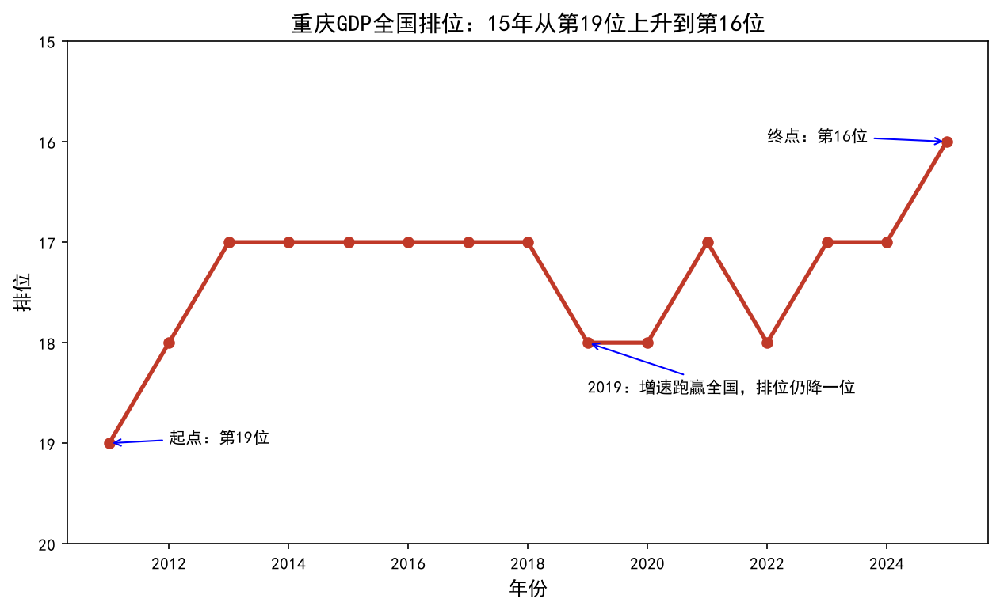
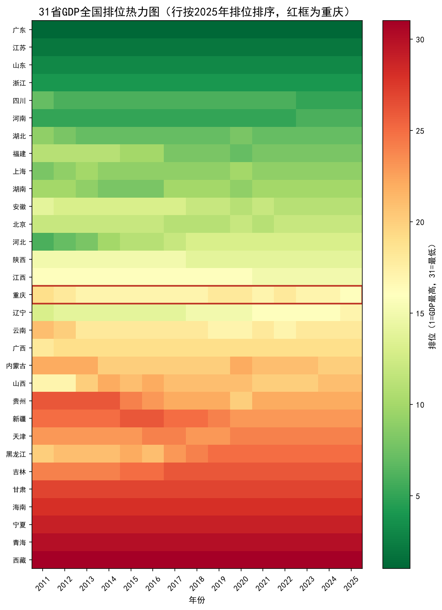

# 分省 GDP 趋势分析（2011-2025）：重庆排位 15 年变迁

> 一条命令把国家统计局多级表头的分省年度数据洗成 465 行干净数据，四张图讲清"重庆 GDP 全国排位 15 年从第 19 升到第 16"——插补、去重、丢行，全程留痕说得清。

## 解决什么问题

分析政府统计数据时，格式坑比分析本身还费时间：

- 多级表头：前几行是大标题不是字段名，直接读字段全错位
- 口径混用：同一列里混着「2024年」和「2024年第4季度」，不筛掉季度行，年度合计直接翻倍
- 占位符：GDP 列的缺失显示为「—」「...」，`isna()` 根本看不见
- 地区名带脏字符：「新疆维吾尔自治区」等后缀长短不一，不统一就没法 groupby
- 尾部脚注、空行、重复行混在数据里

原来要逐个坑手动修，费时且容易漏。
**现在一条命令自动完成清洗、探索分析、四张成品图和一份全留痕的数据质量报告。**

## 输入 / 输出

**输入**：`data/分省年度数据.xlsx`（国家统计局《分省年度数据》，指标：地区生产总值，2011-2025 年，31 个省级行政区）

| 字段 | 类型 | 说明 | 示例值 |
|---|---|---|---|
| 地区 | 文本 | 省级行政区（清洗后不带后缀） | 重庆 |
| 时间 | 整数 | 年份（清洗后仅保留年度） | 2024 |
| 地区生产总值(亿元) | 数字 | 当年 GDP | 32046.7 |

**输出**（脚本同目录，每次运行覆盖）：

- `cleaned_data.xlsx`：465 行干净数据（31 省 x 15 年），「数据来源」列标记每行是原始数据还是插补数据
- `charts/`：4 张成品图（150 dpi，中文正常）
  - 01 全国 GDP 总量趋势（折线，2011 年标注插补口径）
  - 02 重庆排位变化（折线，坐标轴反转，向上 = 进步）
  - 03 重庆 vs 全国增速差值（柱状，2019 反直觉年份高亮）
  - 04 31 省排位热力图（地区 x 年份全景，重庆红框）
- `docs/report.txt`：清洗明细 + 分析过程 + 300 字结论全记录
- `trend_analysis.ipynb`：图文版 Notebook，每步配说明





## 怎么运行

```powershell
# 1. 安装依赖
pip install -r requirements.txt

# 2. 运行（数据已放在 data/ 下）
python trend_analysis.py
```

运行环境：**Python 3.10 及以上** / Windows / pandas 2.0 及以上
（本机实测环境：Python 3.14.8 + pandas 3.0.6 + matplotlib 3.11.2；读 Excel 用 calamine 引擎、写 Excel 用 xlsxwriter 引擎）

中文显示依赖 Windows 自带 SimHei，脚本已同时修复负号变方框问题；其他系统需把字体名换成系统可用中文字体。

运行过程中会逐步打印：每一步剔除了多少行、重复行明细、缺失插补明细（哪个省哪一年、插补值是多少）、行数自洽校验，最后打印完整分析结论——每个数字从哪来全程可见。行数对不上会直接报错终止，不会悄悄丢数据。

## 数据质量说明

**（本次运行的实际数字，换数据后会变化）**

| 项目 | 数值 |
|---|---|
| 读入行数 | 490 |
| 清洗后行数 | 465（31 省 x 15 年） |
| 剔除与去重 | 25 |

**剔除原因**

| 原因 | 行数 |
|---|---|
| 时间列异常（季度行、脚注、脏值如「。。。」） | 21 |
| 地区列异常（非省/市/区，如「-」） | 3 |
| 同地区同年份重复（保留 GDP 有值的行） | 1 |

**缺失插补**：2011 年宁夏、海南、西藏、青海 4 省缺失，用各省 2012-2013 年均值插补；插补行在 `cleaned_data.xlsx` 的「数据来源」列标记为「填充数据」。**引用 2011 年全国总量时需注明含 4 条插补值。**

数据来源：国家统计局 data.stats.gov.cn《分省年度数据》，下载日期 2026-10-04。

**已处理的脏数据**

- [x] 多级表头（跳过前 3 行标题，`header=3`）
- [x] 年度/季度口径混用（只保留以「年」结尾的行，统一为年度）
- [x] 占位符缺失（「—」「...」先转 NaN 再统计处理，不静默填 0）
- [x] 地区名脏字符与行政后缀（去空白/下划线，删省、市、自治区等后缀）
- [x] 同地区同年份重复行（保留有值行，明细打印人工核对）
- [x] 2011 年 4 省缺失（相邻年份均值插补，逐条留痕）
- [x] 行数自洽硬校验（465 + 21 + 1 + 3 = 490，不符即终止）
- [x] 图表中文与负号显示（SimHei + `axes.unicode_minus=False`）

## 目录结构

```
02_trend_analysis/
├── README.md
├── requirements.txt        # 依赖清单
├── trend_analysis.py       # 主脚本（清洗 → 分析 → 出图一条龙）
├── trend_analysis.ipynb    # 图文版 Notebook
├── data/
│   └── 分省年度数据.xlsx    # 输入数据（国家统计局）
├── cleaned_data.xlsx       # 输出结果（本地生成）
├── charts/                 # 4 张成品图（150 dpi）
└── docs/
    └── report.txt          # 清洗明细 + 分析结论全记录
```

## 已知限制

- 2011 年全国总量与增速含 4 条均值插补值，结论中已注明口径
- 插补值取各省 2012-2013 年均值，是估计值；官方后续修订历史数据后需重新下载更新
- 字体配置以 Windows 自带 SimHei 为主，其他操作系统需替换为可用中文字体
- 数据不含港澳台；2025 年数据以统计局当时公布口径为准

## 联系方式

有类似的数据分析需求，或想让我按你的数据定制分析报告，欢迎联系：

- 📮 邮箱：1182618567@qq.com
- 💬 微信：wx_mokong-J

**我还能帮你做**
- 📊 多份 Excel 合并 / 清洗 / 透视分析
- 📈 数据可视化与趋势分析报告
- 🤖 报表自动化：每周手动做的表，一键生成
- 🕷️ 公开数据采集（合规范围内）

**交付标准**：含数据质量报告 + 非技术人员能看懂的使用说明 + 1 个月免费 bug 修复

## 许可证

MIT License — 可自由使用和修改，保留署名即可。
